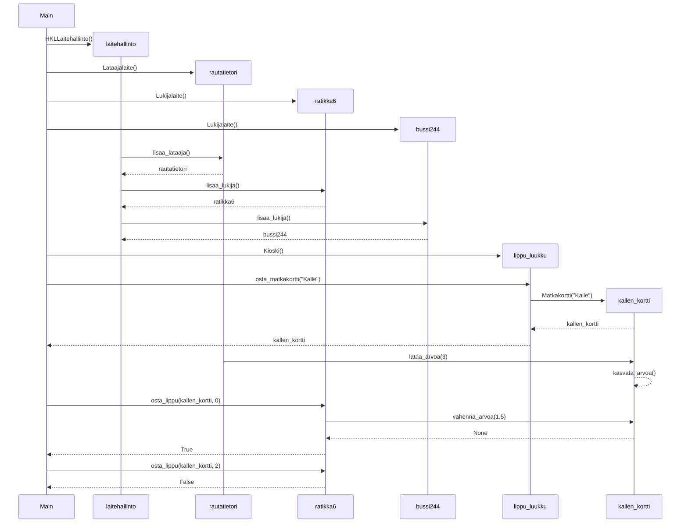

-

```mermaid
sequenceDiagram
    participant Main

    %% Create main objects
    create participant laitehallinto
    Main->>laitehallinto: HKLLaitehallinto()

    create participant rautatietori
    Main->>rautatietori: Lataajalaite()

    create participant ratikka6
    Main->>ratikka6: Lukijalaite()

    create participant bussi244
    Main->>bussi244: Lukijalaite()

    %% Add objects to laitehallinto
    laitehallinto->>rautatietori: lisaa_lataaja()
    rautatietori-->>laitehallinto: rautatietori

    laitehallinto->>ratikka6: lisaa_lukija()
    ratikka6-->>laitehallinto: ratikka6

    laitehallinto->>bussi244: lisaa_lukija()
    bussi244-->>laitehallinto: bussi244


    %% Add lippu_luukku
    create participant lippu_luukku
    Main->>lippu_luukku: Kioski()

    %% Add kallen_kortti
    Main->>lippu_luukku: osta_matkakortti("Kalle")
    create participant kallen_kortti
    lippu_luukku->>kallen_kortti: Matkakortti("Kalle")
    kallen_kortti-->>lippu_luukku: kallen_kortti
    lippu_luukku-->>Main: kallen_kortti

    rautatietori->>kallen_kortti: lataa_arvoa(3)
    kallen_kortti-->>kallen_kortti: kasvata_arvoa()

    Main->>ratikka6: osta_lippu(kallen_kortti, 0)
    ratikka6->>kallen_kortti: vahenna_arvoa(1.5)
    kallen_kortti-->>ratikka6: None
    ratikka6-->>Main: True

    Main->>ratikka6: osta_lippu(kallen_kortti, 2)
    ratikka6-->>Main: False
```