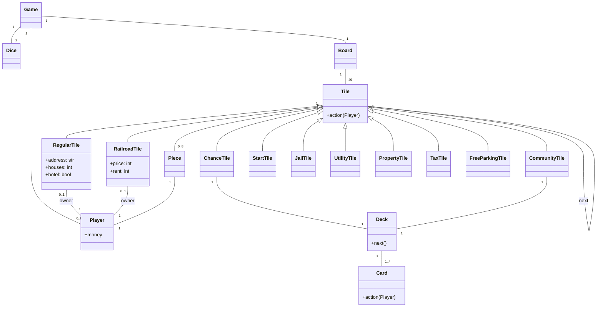

```mermaid
classDiagram
    %% Class Relations
    Game "1" -- "2" Dice
    Game "1" -- "0..8" Player
    Game "1" -- "1" Board
    Board "1" -- "40" Tile

    Tile -- Tile : next
    Tile "1" -- "0..8" Piece

    RegularTile "0..1" -- "1" Player : owner
    RailroadTile "0..1" -- "1" Player: owner
    ChanceTile "1" -- "1" Deck
    CommunityTile "1" -- "1" Deck

    Deck "1" -- "1..*" Card

    Piece "1" -- "1" Player


    %% Class definitions
    class Tile {
        +action(Player)
    }

    class RegularTile {
        +address: str
        +houses: int
        +hotel: bool
    }

    class RailroadTile {
        +price: int
        +rent: int
    }

    class Deck {
        +next()
    }

    class Card {
        +action(Player)
    }

    class Player {
        +money
    }


    %% Tile variations
    Tile <|-- RegularTile
    Tile <|-- StartTile
    Tile <|-- JailTile
    Tile <|-- ChanceTile
    Tile <|-- CommunityTile
    Tile <|-- RailroadTile
    Tile <|-- UtilityTile
    Tile <|-- PropertyTile
    Tile <|-- TaxTile
    Tile <|-- FreeParkingTile
```